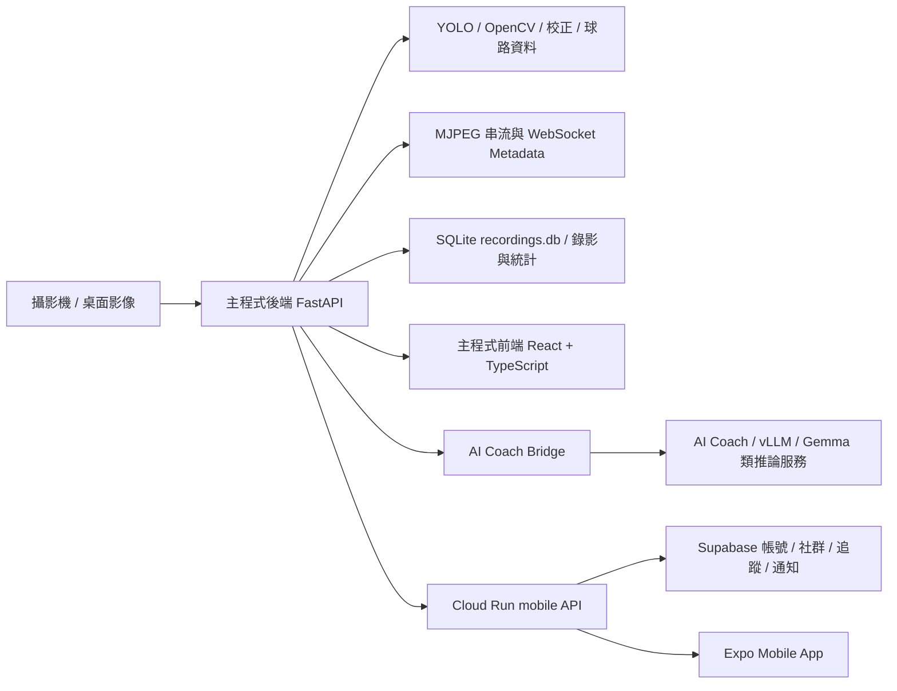

# CueVex 專題報告重點整理

## 06/08:'新增專題報告分工重點整理'

本文用於專題口頭報告與投影片拆分，將 CueVex 撞球分析系統分成「主程式後端」、「主程式前端」、「AI Coach」、「Mobile App」四個主題。若需要分工報告，你負責的範圍建議聚焦在後三者：主程式前端、AI Coach、Mobile。

## 一句話介紹

CueVex 是一套把撞球桌影像、YOLO 球體辨識、即時串流、對戰與練習紀錄、AI 球路建議、社群與手機端數據看板整合在一起的撞球分析平台。系統不只顯示影像，而是把「偵測、分析、回放、教練建議、行動端追蹤」串成完整產品流程。

## 報告主軸

1. 問題：一般撞球練習缺少客觀數據，玩家很難知道自己弱在哪裡，也很難把練習過程保存下來。
2. 解法：用攝影機與 YOLO 辨識球桌狀態，透過後端產生即時分析與 API，再由前端、AI Coach 與 Mobile App 呈現成可操作的功能。
3. 特色：同時支援桌面即時分析、回放紀錄、練習模式、AI 建議、手機社群與數據看板。
4. 成果：完成可運行的桌面端主程式、FastAPI 後端、React 前端、AI Coach 整合、Expo mobile app、Cloud Run mobile API 與 Supabase 資料同步。

## 系統總架構



## 主程式後端

### 這部分要講什麼

主程式後端是整個系統的核心中樞，負責影像處理、辨識模型、資料儲存、串流輸出、WebSocket 狀態同步與 API 路由。報告時可以把它定位成「所有資料與即時分析的來源」。

### 技術重點

- 使用 Python / FastAPI 作為主服務，入口在 `backend/main.py`。
- 啟動時載入 YOLO 模型，透過 `backend/tracking/tracking_engine.py` 進行撞球物件偵測。
- 使用 OpenCV 處理影像、球桌校正、ArUco 校正與投影輔助。
- 使用 MJPEG 輸出 burn-in 即時串流，前端可直接顯示帶有分析資訊的影像。
- 使用 WebSocket 傳送控制訊息與 metadata，讓前端可以拿到即時狀態、連線健康度與分析結果。
- 使用 SQLite 儲存錄影、練習紀錄、對戰紀錄與統計資料。
- 拆分 API router，例如 replay、auth、community、mobile、thumbnail、calibration、camera。
- 在 mobile-lite 模式中用 `backend/cloud_mobile_app.py` 部署到 Cloud Run，專門服務手機端與 Supabase 互動。

### 可以放投影片的功能點

- 即時影像串流：`/burnin/{stream_id}.mjpg`
- 控制與狀態同步：`/ws/control`
- 錄影回放：錄影檔、縮圖、metadata、events
- 練習模式：單球練習、球型練習、準度與統計
- 校正功能：相機參數、球桌 ROI、投影校正
- Mobile API：`/api/mobile/dashboard`、profile、feed、follow、block、notification

### 報告講法

可以說：「後端不是單純提供 REST API，而是同時處理即時影像、AI 辨識、串流、WebSocket、錄影資料與手機端資料同步。因此它是 CueVex 的資料中樞，也是前端與 AI Coach 能運作的基礎。」

## 主程式前端

### 這部分要講什麼

主程式前端是桌面端使用者實際操作 CueVex 的地方，負責把後端的即時串流、辨識狀態、對戰流程、練習流程、回放、統計與 AI Coach 入口整合成可用介面。

### 技術重點

- 使用 React / TypeScript / Vite。
- 主要入口與頁面調度集中在 `frontend/src/components/Dashboard.tsx`。
- 使用自建 SDK 封裝 session、WebSocket、metadata buffer 與 connection health。
- 前端不直接處理高頻影像辨識運算，而是接收後端串流與 metadata，避免 React 被高頻資料拖慢。
- 使用 i18n 支援繁中、簡中、英文。
- 使用 lucide icon、Recharts、Tailwind/CSS 組成桌面操作介面。

### 前端可講的頁面與流程

- 首頁 / 監控頁：顯示即時 burn-in 串流、YOLO 狀態、系統狀態。
- 遊玩模式：正式對局流程與狀態管理。
- 練習模式：單球、球型、準度練習與成績呈現。
- 回放系統：選擇玩家、查看錄影清單、播放錄影、查看統計。
- 社群頁：桌面端社群入口與內容顯示。
- AI Coach 浮動入口：非遊玩模式可開啟，遊玩模式禁用以避免作弊情境。

### 前端設計重點

- 把複雜的即時狀態轉成清楚的儀表板。
- 透過 WebSocket 狀態與 connection health 告訴使用者目前系統是否正常。
- 將練習、回放、數據與 Coach 放在同一套操作流程中，不需要跳到不同工具。
- AI Coach 入口需遵守規則：正式遊玩模式不可使用，練習或分析情境才可使用。

### 報告講法

可以說：「我負責的前端部分重點不是只做畫面，而是把後端串流、WebSocket 即時狀態、練習流程、回放紀錄與 AI Coach 入口整合成一個玩家真的能操作的產品介面。」

## 06/09:'新增藍色核心藍圖雙頁報告版'

新增兩張 drawio 報告用藍圖，將原本藍色核心流程拆成兩頁呈現：

- `CueVex-blue-report-01-core.drawio`：桌面端核心分析流程，從 Camera Input、Capture Analyze Loop、PoolTracker、YOLO/OpenCV、校正、球號/狀態驗證、RoutePlanner、物理引擎，到 FastAPI Service。
- `CueVex-blue-report-02-output.drawio`：FastAPI 輸出與呈現流程，包含 REST API、WebSocket、MJPEG Stream、latest_analysis_data、Metadata Packet、React UI，以及 Replay / Stats、AI Coach、Mobile Cloud 等外部邊界框。

規範用法：專題報告建議分成兩張投影片或兩段報告說明。第一張先說明桌面端如何把攝影機畫面轉成可用分析結果；第二張再說明分析結果如何透過 API、WebSocket、串流與外部模組銜接。兩張圖已用外側通道整理跨區連線，避免線條打結、穿過方塊或互相交叉。

## 06/09:'新增橘色紫色綠色區域報告藍圖'

新增三張 drawio 報告用區域圖，將總架構中的其他三個顏色獨立成可分頁說明的藍圖：

- `CueVex-orange-report-replay-stats.drawio`：橘色 Replay / Stats 區域，說明 Recording Event 進入 Recorder，分別寫入 SQLite 與 Recordings Filesystem，再由 Replay API 查詢 DB、讀取媒體檔並輸出 Replay UI / Stats。
- `CueVex-purple-report-ai-coach.drawio`：紫色 AI Coach 區域，說明 Coach Payload 與 Dashboard Request 進入 Coach REST API / CoachBridge，再透過 AI Coach WS Service 與 LLM Inference 產生 Coach Suggestions。
- `CueVex-green-report-mobile-cloud.drawio`：綠色 Mobile Cloud 區域，說明 Expo Mobile App 呼叫 Cloud Run API，分流到 Auth、Community、Dashboard、Profile / Follow / Block / Notifications API，最後讀寫 Supabase。

規範用法：報告時可將藍色核心流程拆成兩頁，再接橘色、紫色、綠色各一頁。每張圖都用外部邊界框表示跨色依賴，避免把所有跨系統線畫在同一張圖造成線條打結。

## AI Coach

### 這部分要講什麼

AI Coach 是 CueVex 的智慧建議層。它把後端偵測到的球桌狀態、練習資料與語意化 payload 轉成教練建議，讓系統不只告訴使用者「發生什麼」，也能回答「下一步怎麼打、該怎麼練」。

### 技術重點

- 後端透過 `CoachBridge` 與 AI Coach service 溝通。
- 使用 `/ws/coach` 作為 AI Coach 即時通道。
- `backend/core/coach_payload_builder.py` 負責整理 Coach 可理解的資料。
- `backend/core/coach_semantics.py` 負責使用者意圖與語意分類。
- AI 推論層可接 vLLM / Gemma 類模型服務，桌面端可用本機或遠端推論。
- AI Coach 前端元件包含浮動聊天入口與對話窗。

### AI Coach 功能可以拆成三層

1. 資料層：取得目前球桌狀態、球的位置、練習或對戰脈絡。
2. 推論層：把資料送給 AI Coach service，產生球路建議、練習建議或解釋。
3. 呈現層：在前端聊天窗或建議面板顯示白話化建議。

### 重要規則

- 正式遊玩模式不開放 AI Coach，避免變成作弊輔助。
- 若 YOLO 停擺或分析資料不可用，Coach 不應產生假建議，需顯示暫停或錯誤狀態。
- 遠端展示時可用 Cloudflare Quick Tunnel 暴露前端與後端 API，但 AI Coach WebSocket service 本身維持內部連線。

### 可示範內容

- 在練習或監控頁開啟 AI Coach。
- 詢問目前球桌狀態或下一球建議。
- 展示 Coach 回答如何從純資料變成白話建議。
- 說明為什麼遊玩模式禁用 Coach。

### 報告講法

可以說：「AI Coach 的價值在於把辨識結果轉成教練語言。一般影像辨識只會給座標或狀態，但 CueVex 透過 Coach payload 與 AI 推論，把它變成玩家看得懂的建議。」

## Mobile App

### 這部分要講什麼

Mobile App 是 CueVex 從桌面分析工具走向使用者日常產品的關鍵。桌面端負責即時偵測與操作，手機端負責帳號、社群、個人頁、追蹤、封鎖、安全、通知與數據看板。

### 技術重點

- 使用 Expo / React Native。
- 主要程式集中在 `mobile/App.tsx`。
- API client 在 `mobile/src/api.ts`，型別在 `mobile/src/types.ts`。
- 手機端預設連到 Cloud Run mobile API。
- Cloud Run mobile API 由 `backend/cloud_mobile_app.py` 啟動，載入 auth、community、mobile router。
- Supabase 負責 mobile users、profiles、follows、community posts、comments、bookmarks、notifications 等資料。
- 本機 SQLite 與 Supabase 有 fallback 與同步邏輯，提升開發與部署彈性。

### Mobile 主要功能

- 登入與註冊。
- 我的頁與公開個人頁。
- 編輯個人資料、頭像、隱私設定。
- 社群貼文、圖片上傳、留言、按讚、收藏。
- following feed、trending feed、收藏列表。
- 追蹤者與追蹤中名單。
- 私人帳號可見性規則。
- 封鎖與安全：封鎖使用者、解除封鎖、雙向內容過濾。
- 推播通知設定、push token、通知事件。
- 數據頁 V1：整體能力分數、五大能力、AI Coach 白話總結、本週推薦訓練。

### Mobile 數據看板重點

手機端的數據頁不是單純把桌面數字搬過來，而是把紀錄轉成新手也能理解的三個問題：

- 我目前強不強？
- 哪裡最弱？
- 本週該練什麼？

`GET /api/mobile/dashboard` 會回傳 `analytics_v1`，後端產生能力分數與建議，手機端只負責呈現：

```json
{
  "overall_score": 62,
  "level_label": "新手進階中",
  "weakest_ability": "母球控制",
  "coach_summary": "你的準度目前最穩，但母球控制還需要加強。",
  "recommended_trainings": [
    {
      "title": "定點停球訓練",
      "duration_minutes": 10
    }
  ]
}
```

### Mobile 安全與社群規則

- 封鎖不是單一按鈕，而是跨 profile、feed、friends、community 的可見性模型。
- 封鎖後需取消雙方追蹤，但不刪除既有內容。
- 被封鎖或封鎖對方時，個人頁、貼文、追蹤狀態與社群互動都要依規則降級顯示。
- 私人帳號、封鎖、取消追蹤不能混成同一種狀態，因為使用者語意不同。

### 報告講法

可以說：「我負責的 Mobile 不只是把網頁縮小，而是另一個完整產品面。它處理帳號、社群、個人頁、通知、安全規則與數據教練看板，讓 CueVex 從桌面分析工具延伸成玩家日常會用的 App。」

## 電腦視覺與球桌分析核心

### 這部分為什麼重要

CueVex 的第一層資料來源不是人工輸入，而是攝影機畫面。電腦視覺負責把真實球桌轉成系統可以理解的資料，因此這一段是專題技術含量最高的基礎之一。

### 要講的重點

- 攝影機取得球桌畫面後，後端用 OpenCV 做影像處理與座標轉換。
- YOLO 模型負責偵測球的位置與類別，讓系統知道目前桌面上有哪些球。
- ROI 與校正功能用來界定球桌範圍，避免背景或桌外物件干擾判斷。
- ArUco 與投影校正可協助對齊球桌與投影畫面。
- 偵測結果會被後端整理成 metadata，再提供給前端、AI Coach、回放與練習統計使用。

### 報告講法

可以說：「電腦視覺是 CueVex 的資料入口。系統先用攝影機取得球桌畫面，再透過 YOLO 和 OpenCV 把畫面轉成球的位置、球桌範圍與即時狀態，後面的前端、AI Coach 和數據功能都建立在這些分析結果上。」

## 錄影回放與資料保存

### 這部分為什麼重要

如果系統只做即時偵測，使用者看完就結束；有錄影與資料保存後，玩家才能回顧比賽、比較練習結果，並累積長期數據。

### 要講的重點

- 對戰與練習可保存成錄影資料。
- 每筆紀錄包含影片、縮圖、metadata 與事件資料。
- SQLite `recordings.db` 儲存錄影索引、玩家資料、練習結果與統計。
- 前端回放頁可依玩家或模式查看錄影清單。
- 回放資料也能成為之後 AI 分析與 mobile 數據看板的基礎。

### 可以展示的內容

- 錄影清單。
- 影片回放。
- 玩家統計。
- 練習紀錄。
- 單筆回放的 metadata 或事件資料。

### 報告講法

可以說：「錄影回放讓 CueVex 不只是即時偵測工具，而是能保存練習歷程的分析平台。使用者可以回頭看每一次練習或對戰，系統也能用這些資料產生長期統計。」

## 練習模式與數據分析

### 這部分為什麼重要

練習模式是 CueVex 從偵測系統變成訓練工具的關鍵。它讓系統不只記錄比賽結果，也能針對單一能力做訓練與回饋。

### 要講的重點

- 單球練習可聚焦在基本準度。
- 球型練習可訓練走位與連續進攻。
- 準度訓練可產生玩家練習結果。
- 練習紀錄會進入統計資料，後續可用於 mobile 數據看板。
- AI Coach 可根據練習脈絡給出更白話的訓練建議。

### 報告講法

可以說：「練習模式把 CueVex 從單純看球桌狀態，推進到訓練流程。玩家可以針對準度、母球控制、力道與走位進行練習，這些資料最後會回到統計與 mobile 數據看板。」

## 即時通訊與效能設計

### 這部分為什麼重要

CueVex 同時有影像串流、辨識狀態、控制指令與 AI 建議，如果全部用一般 HTTP 輪詢，延遲與效能都會不好。因此系統需要把不同資料用不同通道處理。

### 要講的重點

- REST API：適合查詢設定、歷史資料、profile、feed 與統計。
- MJPEG：適合輸出即時影像串流。
- WebSocket：適合即時控制、狀態同步與 metadata 更新。
- 前端不直接對每一幀做 React re-render，避免高頻資料造成 UI 卡頓。
- SDK 封裝 session、WebSocket reconnect、metadata buffer 與 connection health，讓前端元件不用直接處理底層通訊細節。

### 報告講法

可以說：「CueVex 把不同類型資料拆到不同通道。影像用 MJPEG，狀態用 WebSocket，歷史資料與設定用 REST API，這樣可以兼顧即時性與前端效能。」

## 資料庫與資料流

### 這部分為什麼重要

專題報告如果只講畫面，會比較像功能展示；補上資料流後，可以讓老師看出系統是完整架構。

### 桌面端資料

- `recordings.db`：保存錄影、練習、玩家與統計資料。
- `recordings/`：保存影片、縮圖、metadata 與 events。
- 後端 API 將資料整理後給 React 前端與 AI Coach 使用。

### Mobile 資料

- Supabase 保存 mobile users、profiles、follows、community posts、comments、bookmarks、blocks、notifications。
- Cloud Run mobile API 是手機端對外入口。
- Mobile App 不直接碰資料庫，而是透過 API client 呼叫後端。
- 本機 SQLite 與 Supabase 具備 fallback 關係，方便本機開發與雲端部署。

### 報告講法

可以說：「桌面端資料主要保存本機錄影與練習紀錄，手機端資料則放在 Supabase，讓跨裝置登入、社群與通知可以同步。兩邊透過 API 串起來，形成完整資料流。」

## 部署與展示架構

### 這部分為什麼重要

部署架構可以說明專案不是只能在開發者電腦跑，而是有考慮展示、遠端存取與手機端使用。

### 要講的重點

- 桌面主程式：本機 FastAPI + React/Vite。
- AI Coach：可用本機或遠端 vLLM / Gemma 類服務。
- Mobile API：部署到 Google Cloud Run。
- Mobile 資料：使用 Supabase。
- 遠端展示：可透過 Cloudflare Quick Tunnel 讓其他裝置打開桌面前端。
- 對外展示通常只暴露 frontend 與 backend API，AI Coach WebSocket service 維持內部連線。

### 報告講法

可以說：「桌面端適合現場即時分析，手機端則透過 Cloud Run 和 Supabase 支援跨裝置資料。展示時也能透過 Cloudflare tunnel 讓其他裝置看到前端畫面。」

## 權限、安全與可見性規則

### 這部分為什麼重要

Mobile App 有社群功能後，就不能只做單純 CRUD，還要處理使用者關係、私人帳號、封鎖與內容可見性。

### 要講的重點

- 私人帳號會限制非追蹤者看到的內容。
- 追蹤與取消追蹤會影響 following feed 與個人頁可見性。
- 封鎖使用者會取消雙方追蹤關係，但不刪除既有貼文、留言、按讚或收藏。
- 封鎖狀態會影響 profile、feed、community、friends 等多個地方。
- 封鎖方與被封鎖方看到的畫面不同，這代表系統有明確處理使用者語意。

### 報告講法

可以說：「Mobile 的社群功能不只是新增貼文，而是有完整的關係規則。私人帳號、追蹤、封鎖和內容可見性都會影響 API 回傳與前端畫面。」

## 錯誤處理與診斷工具

### 這部分為什麼重要

大型系統一定會遇到部署、連線、資料庫或模型問題。能不能快速定位錯誤，是工程完整度的重要指標。

### 要講的重點

- `/health` 用於確認後端服務是否正常。
- `/api/diagnostics/cloud-mobile` 用於檢查 Cloud Run mobile API 與 Supabase 設定。
- `/api/diagnostics/mobile-profile/{user_id}` 用於定位 mobile profile、posts、follow count 與 Supabase payload 問題。
- YOLO 停擺時，AI Coach 不會產生假建議，而是回傳暫停或錯誤狀態。
- Cloudflare tunnel URL 是暫時性的，每次展示需確認最新網址。

### 報告講法

可以說：「我們不只做功能，也做診斷端點。當 mobile 頁面或 Supabase 資料出問題時，可以直接用 diagnostics API 定位是哪一層失敗。」

## 測試與驗證方式

### 這部分為什麼重要

報告時補上驗證方式，可以讓專題看起來更像正式工程，而不是只靠手動展示。

### 驗證重點

- 後端：Python compile、focused pytest、API payload sanity check。
- 前端：`npm run build` 確認 TypeScript 與 Vite 編譯通過。
- Mobile：`npm run typecheck` 確認 Expo TypeScript 型別正確。
- Cloud Run：用 `/health` 與 diagnostics API 確認部署設定。
- Supabase：檢查 account、profile、post、follow、block、notification 資料是否可讀寫。

### 報告講法

可以說：「每次功能修改後，我們不是只看畫面，而是會做後端測試、前端 build、mobile typecheck，以及 API diagnostics，確認功能真的能跑。」

## 06/26:'新增專案簡報評估設計'

這一段用來回應專題簡報中的評估問題，重點不是只說「系統可以跑」，而是把 CueVex 拆成可量測的端到端流程、辨識混淆、消融實驗與流程耗時。

### Slide：系統端對端評估與混淆舉證

端到端評估建議用「輸入影像到使用者可見結果」作為主軸，而不是只評估單一模型。

評估流程：

1. 相機輸入：固定球桌、光源、視角與 ROI，準備多組球型畫面或錄影片段。
2. 偵測輸出：紀錄 YOLO bbox、mask、球色、球號、白球、目標球與桌面座標。
3. 分析輸出：檢查合法目標球、路線規劃、袋口、阻擋、風險與 AI Coach payload 是否一致。
4. 前端呈現：檢查 burn-in overlay、WebSocket metadata、投影路線、回放資料是否與同一幀分析結果對齊。
5. 使用者結果：用「是否能看懂下一球建議、是否能回放與累積統計」作為產品端驗收。

可放投影片的量化指標：

| 評估項目 | 指標 | 來源 |
| --- | --- | --- |
| 球體偵測 | precision、recall、IoU、漏檢數、誤檢數 | YOLO 標註資料或人工標記影格 |
| 球色/球號判斷 | accuracy、strict accuracy、confusion matrix | `/api/color-calibration/profiles/{profile_id}/validation` |
| 系統一致性 | 同一幀 detection 與 route 是否同源、是否出現舊路線殘留 | WebSocket metadata、`multi_plan`、回放 metadata |
| 產品可用性 | overlay 是否顯示、AI Coach 是否引用正確盤面、回放是否可查 | 桌面端、AI Coach、Replay UI |

混淆舉證建議使用顏色/球號混淆矩陣：

```json
{
  "total_samples": 120,
  "correct": 108,
  "unknown": 4,
  "accuracy": 0.9,
  "strict_accuracy_excluding_unknown": 0.931,
  "confusion": {
    "yellow": { "yellow": 18, "orange": 2 },
    "purple": { "purple": 16, "blue": 1, "Unknown": 1 }
  }
}
```

講法：

可以說：「我們的端到端評估不是只看 YOLO 有沒有框，而是從攝影機輸入一路追到前端 overlay、路線規劃、AI Coach 與回放紀錄。混淆矩陣用來舉證哪些球色或球號容易混淆，例如黃球與橘球、紫球與藍球，這些錯誤會直接影響後續路線建議，因此必須放在系統評估裡。」

### Slide：消融實驗

消融實驗用來證明每個模組不是單純堆功能，而是真的改善辨識穩定度、延遲或使用者結果。建議每次只移除或切換一個模組，其他環境保持固定。

| 實驗組別 | 關閉或替換項目 | 觀察指標 | 預期要證明 |
| --- | --- | --- | --- |
| Baseline | 只用 first-pass YOLO，不做 second-pass 補強 | recall、漏檢數、FPS、`yolo_result.avg_ms` | second-pass 對低召回畫面是否有幫助 |
| Second-pass 預設 | `SECOND_PASS_IMG_SIZE=640`、`CONF=0.08`、cooldown | recall、誤檢數、延遲 | 目前預設在召回與延遲間較平衡 |
| 高召回模式 | 提高 `SECOND_PASS_IMG_SIZE` 或降低 conf | recall、誤檢數、P95 延遲 | 召回提高是否造成效能與誤框成本 |
| 無顏色校正 | 關閉 learned templates，只用一般 HSV 規則 | color accuracy、confusion matrix | 色彩校正是否降低球色混淆 |
| 有顏色校正 | 使用 auto-scan/K-Means 樣本與 validation | color accuracy、Unknown 數 | learned templates 對現場光源是否有效 |
| 無路線穩定 | 不沿用上一筆 plan、不做 target hold | route flicker 次數、錯誤提示次數 | hysteresis 是否降低路線跳動 |
| 有路線穩定 | 使用 `hysteresis_hold`、state hash cache、route switch margin | route 穩定度、planner latency | 穩定策略是否改善展示體驗 |
| 無 AI Coach payload | 只顯示 raw metadata | 使用者是否能理解建議 | Coach 是否把資料轉成可理解建議 |
| 有 AI Coach payload | 使用語意摘要與盤面脈絡 | 建議可讀性、錯誤建議率 | Coach 是否提升產品價值 |

投影片呈現建議：

- 不要放太多組，正式簡報可選 3 組：second-pass、顏色校正、路線穩定。
- 每組用「關閉前 / 開啟後」截圖或短表格呈現。
- 指標同時放準確度與耗時，避免只追準確率卻犧牲即時性。

講法：

可以說：「消融實驗的目的，是證明每個工程模組都有實際價值。例如 second-pass 可以改善低召回畫面，但也會增加 YOLO 耗時；顏色校正可以降低球色混淆；路線穩定策略則避免偵測短暫抖動時前端路線一直跳。」

### Slide：流程耗時

流程耗時要分成兩層：即時影像主流程與 API/資料查詢流程。

即時影像主流程建議拆解：

| 階段 | 量測欄位 | 說明 |
| --- | --- | --- |
| 相機取幀 | `camera_grab`、`camera_read` | 判斷 USB 相機、曝光或 buffer flush 是否拖慢 |
| YOLO 推論 | `yolo_result.avg_ms`、`stale_frames` | 主瓶頸通常在這裡 |
| OpenCV/後處理 | color、table、metadata 相關階段 | 判斷球色、ROI、座標整理成本 |
| RoutePlanner | `multi_plan.latency_ms` 或 planner 回傳 `latency_ms` | 判斷路線候選、評分、lookahead 成本 |
| 投影更新 | `projector_render_update.avg_ms` | 判斷投影畫面是否造成主流程延遲 |
| 錄影入列 | `recording_enqueue.avg_ms` | 判斷錄影 queue 或 frame copy 是否拖慢 |
| FPS 控制 | `fps_cap_sleep.avg_ms` | 若此值高，代表系統被上限限制，不一定是瓶頸 |

API/資料查詢流程已有壓測報告可引用：

| Endpoint | 平均耗時 | P95 | P99 | 錯誤率 |
| --- | ---: | ---: | ---: | ---: |
| `/health` | 44.35 ms | 54.80 ms | 66.40 ms | 0% |
| `/api/recordings?mode=game` | 46.90 ms | 56.72 ms | 61.56 ms | 0% |
| `/api/recordings?mode=practice` | 53.10 ms | 69.35 ms | 76.78 ms | 0% |
| `/api/stats/player/{player}` | 46.20 ms | 54.14 ms | 59.11 ms | 0% |
| `/api/stats/summary` | 47.88 ms | 60.16 ms | 73.39 ms | 0% |
| `/api/performance/stats` | 42.01 ms | 48.74 ms | 57.78 ms | 0% |

上述數字來自 `backend/test-program/reports/stability_report_20260323_001425.json`，測試設定為 6 個 endpoint、每個 200 次正式請求、10 次 warmup、總請求 1200 次、總錯誤率 0%。正式簡報前建議用現場展示機重跑一次，避免硬體、相機與模型版本不同造成數字過期。

可放投影片的命令：

```powershell
Invoke-RestMethod http://127.0.0.1:8001/api/performance/stats | ConvertTo-Json -Depth 6
backend\test-program\utils\stability_benchmark.ps1 -BaseUrl http://localhost:8001
```

講法：

可以說：「耗時評估分兩種。即時影像流程用 `/api/performance/stats` 看相機、YOLO、投影與錄影各階段耗時；API 查詢流程則用穩定性壓測看平均、P95、P99 與錯誤率。這樣可以分辨瓶頸是模型推論、相機取幀、投影更新，還是一般 API 查詢。」

## 專題挑戰與解法

### 挑戰 1：即時影像與前端效能

- 問題：影像與 metadata 更新頻率高，若直接驅動 React 高頻重繪會卡頓。
- 解法：影像用 MJPEG，狀態用 WebSocket，前端用 SDK 與 buffer 控制更新節奏。

### 挑戰 2：YOLO 不穩時 AI Coach 不能亂給建議

- 問題：如果辨識停擺，AI Coach 仍產生建議會誤導使用者。
- 解法：後端保留 YOLO stalled 狀態，Coach 在資料不可用時回傳暫停或錯誤訊息。

### 挑戰 3：Mobile 資料需要跨裝置同步

- 問題：本機 SQLite 無法滿足 mobile 跨裝置登入、社群與通知。
- 解法：Mobile API 部署到 Cloud Run，資料放 Supabase，手機端透過 API 存取。

### 挑戰 4：封鎖與私人帳號規則複雜

- 問題：封鎖、私人帳號、追蹤狀態不是同一件事，不能用單一 hidden flag 解決。
- 解法：後端建立明確的 relationship 與 visibility 規則，前端依 `block_state`、`is_private`、`is_following` 呈現不同狀態。

### 挑戰 5：展示環境不固定

- 問題：現場展示可能要跨裝置、臨時網路或不同電腦。
- 解法：提供 Cloudflare Quick Tunnel、Cloud Run mobile API 與 diagnostics API，讓展示前可以快速確認服務狀態。

## 你負責的部分建議報告順序

1. 主程式前端：先說桌面端如何把後端即時資料呈現出來。
2. AI Coach：接著說如何從即時資料產生教練建議。
3. Mobile：最後說如何把桌面分析延伸成手機端社群與數據看板。

這樣的順序有清楚因果：前端承接即時資料，AI Coach 提升成智慧建議，Mobile 則把結果產品化與日常化。

## 投影片建議

### Slide 1：專案目標

- 撞球練習缺少客觀數據與即時回饋。
- CueVex 用影像辨識與 AI Coach 協助玩家分析、練習與回顧。

### Slide 2：系統總架構

- 攝影機輸入。
- FastAPI 後端。
- YOLO / OpenCV 分析。
- React 桌面前端。
- AI Coach。
- Expo Mobile + Cloud Run + Supabase。

### Slide 3：主程式後端

- 即時串流、YOLO 辨識、WebSocket、錄影、統計、API。
- 強調它是資料中樞。

### Slide 4：主程式前端

- Dashboard、監控頁、遊玩模式、練習模式、回放、統計。
- 強調使用者操作流程與即時狀態呈現。

### Slide 5：AI Coach

- CoachBridge、payload builder、AI 推論、聊天窗。
- 強調從資料到建議。

### Slide 6：Mobile App

- 帳號、社群、個人頁、追蹤、封鎖、通知、數據看板。
- 強調手機端是完整產品，不是附屬 demo。

### Slide 7：資料與部署

- 桌面端：本機 FastAPI + React。
- Mobile API：Cloud Run。
- Mobile data：Supabase。
- 遠端展示：Cloudflare Quick Tunnel。

### Slide 8：電腦視覺與資料保存

- 攝影機畫面、YOLO 偵測、OpenCV 處理、ROI 校正。
- 錄影、縮圖、metadata、events 與 SQLite 統計。
- 強調 CueVex 不是只做即時畫面，而是能保存與分析長期資料。

### Slide 9：即時通訊與資料流

- MJPEG 負責即時影像。
- WebSocket 負責控制與 metadata。
- REST API 負責設定、歷史資料、profile、feed 與統計。
- SQLite 保存桌面端紀錄，Supabase 保存 mobile 社群資料。

### Slide 10：測試、診斷與部署驗證

- 後端 pytest / py_compile。
- 前端 build。
- Mobile typecheck。
- `/health`、`/api/diagnostics/cloud-mobile`、`/api/diagnostics/mobile-profile/{user_id}`。
- Cloud Run 與 Supabase 設定檢查。

### Slide 11：端對端評估與混淆舉證

- 從相機輸入追到 YOLO、球色球號、路線規劃、前端 overlay、AI Coach 與回放。
- 用 color calibration validation 的 accuracy、strict accuracy 與 confusion matrix 舉證容易混淆的球色/球號。
- 強調錯誤不是只停在模型層，會影響合法目標球、路線建議與 Coach 回答。

### Slide 12：消融實驗

- 比較 second-pass 開關、顏色校正開關、路線穩定策略開關。
- 每組同時看準確率、漏檢/誤檢、路線跳動與延遲。
- 用「關閉前 / 開啟後」截圖或表格呈現。

### Slide 13：流程耗時

- 即時流程：相機取幀、YOLO、後處理、RoutePlanner、投影、錄影、FPS cap。
- API 流程：health、recordings、stats、performance stats 的 avg、P95、P99、錯誤率。
- 說明如何用 `/api/performance/stats` 和 stability benchmark 找瓶頸。

### Slide 14：遇到的挑戰

- 即時影像與 React UI 的效能切分。
- YOLO 狀態不穩時不能產生錯誤 AI 建議。
- Mobile 社群資料需在 SQLite 與 Supabase 間保持一致。
- 封鎖、私人帳號、追蹤關係需清楚定義。

### Slide 15：成果展示

- 桌面端即時分析畫面。
- AI Coach 建議畫面。
- Mobile 個人頁、社群頁、數據看板。

### Slide 16：結論與未來方向

- 目前已完成從偵測到產品介面的完整流程。
- 未來可補單球級擊球事件、力道誤差、母球落點誤差、更多 AI 訓練資料與正式部署流程。

## Demo 建議

1. 開主程式桌面前端，展示監控頁與串流。
2. 進入練習模式或回放頁，展示紀錄與數據。
3. 開啟 AI Coach，問一個球路或練習建議。
4. 開手機端，展示登入、我的頁、社群、追蹤或封鎖。
5. 打開數據頁，展示五大能力與推薦訓練。

## 常見問答準備

### Q1：為什麼需要 Mobile App？

桌面端適合即時偵測與現場操作，但玩家日常查看紀錄、社群互動、追蹤朋友、看數據與接收通知更適合手機端。因此 Mobile 是產品化延伸。

### Q2：AI Coach 的資料從哪裡來？

資料來自主後端整理出的球桌狀態、練習脈絡與 Coach payload。AI Coach 不是直接看畫面猜測，而是使用後端分析後的結構化資料產生建議。

### Q3：為什麼遊玩模式不能用 AI Coach？

因為正式對局中使用 Coach 會接近作弊輔助，所以系統只在練習、分析或非正式遊玩情境開放 AI Coach。

### Q4：Mobile 的數據分數準確嗎？

目前 V1 是根據對戰、練習次數與近期紀錄做保守推估，適合當新手方向建議。未來若加入單球角度誤差、力道誤差與母球落點資料，分數可信度可以再提升。

### Q5：這個系統最大的技術整合點是什麼？

最大整合點是把即時影像辨識、WebSocket、錄影資料、AI Coach、桌面前端、Mobile API 與 Supabase 串成同一個產品流程，而不是各自獨立的 demo。

## 分工說明範例

如果報告時需要說明你的負責範圍，可以這樣講：

> 我主要負責主程式前端、AI Coach 整合與 Mobile App。前端部分負責把後端即時串流、WebSocket 狀態、練習與回放流程呈現成可操作介面；AI Coach 部分負責把分析資料轉成教練建議並嵌入前端；Mobile 部分負責帳號、個人頁、社群、追蹤封鎖、通知與數據看板，讓 CueVex 從桌面分析工具延伸成完整的手機產品。

## 最重要的三句總結

1. CueVex 的核心不是單一 AI 模型，而是完整的撞球分析產品流程。
2. 主程式後端負責偵測、串流、API 與資料；主程式前端負責操作體驗；AI Coach 負責把資料變成建議；Mobile 負責日常化與社群化。
3. 你負責的部分可以強調「使用者看得到、用得到、能理解」的產品化成果。
